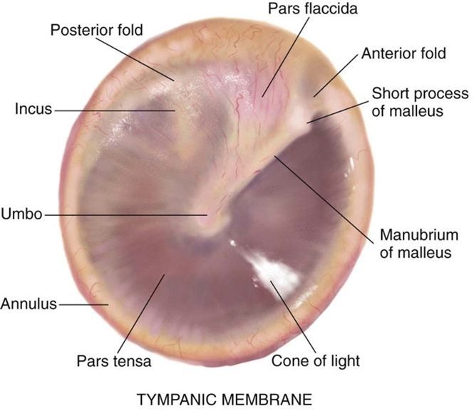

# Ear Disease Detection

## Introduction

Otitis Media (OM) is an infection of the middle ear. It is one of the most common childhood illnesses and the second most important reason leading to the loss of hearing. It is most common in developing countries and was ranked fifth on the global burden of disease and affected 1.23 billion people in 2013.

OM is often misdiagnosed or not diagnosed at all, especially when it is in the early stages. It is often either under-diagnosed or over-diagnosed depending on the factors like clinicians, symptoms, otoscopes etc. Detection of OM requires a good medical practitioner (ENT), whose availability is difficult in remote village areas especially in developing countries. That is why OM is ignored amongst these kinds of groups and is a second major cause of hearing loss.

The aim of the study is to develop a diagnostic system using Ear Drum (Tympanic Membrane) images and applying machine learning to automatically extract certain features and perform image classification which can help diagnose otitis media(OM) with greater accuracy.
This diagnostic system will provide a reliable data to a survey volunteer to advise the patient or his family to visit an ENT or take professional help if OM is present.

## Dataset

Cannot be public

## References

- https://core.ac.uk/download/pdf/161426117.pdf
- https://www.sciencedirect.com/science/article/pii/S2352396419304311
- https://arxiv.org/abs/1512.03385
- https://medium.com/bhavaniravi/build-your-1st-python-web-app-with-flask-b039d11f101c
- https://keras.io/api/applications/inceptionv3/
